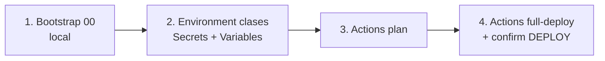

# GitHub Actions — FreshBox EP1

Automatización **semi-manual** para el Learner Lab: nada se aplica solo con un `git push` a `main` (protege presupuesto).

## Workflows

| Workflow | Cuándo corre | Qué hace |
|----------|--------------|----------|
| **Terraform CI** | PR / push (cambios TF) | `fmt` + `validate` + cache de providers. **Sin AWS.** |
| **Deploy Lab (semi-auto)** | Solo clic manual (`workflow_dispatch`) | plan / apply / full-deploy / images-only / destroy |

## Orden correcto (primera vez)

1. Local: `00-terraform-state` → bucket S3 + tabla locks  
2. GitHub → Environment **`clases`**  
3. Actions → **Deploy Lab** → `plan`  
4. Si el plan OK → `full-deploy` + escribe **`DEPLOY`**

## Parámetros del Deploy Lab

Al hacer **Run workflow** verás tres campos:

### `action` (qué hacer)

| Valor | Significado | ¿Toca infra TF? | ¿Build Docker? |
|-------|-------------|-----------------|----------------|
| `plan` | Solo previsualiza el plan de Terraform | No | No |
| `apply` | Aplica VPC/ALB/ASG/MySQL/ECR (TF) | Sí | No |
| `full-deploy` | Apply + imágenes ARM64 + recicla ASG + smoke test | Sí | Sí (salvo skip) |
| `images-only` | Solo imágenes + recycle ASG (nginx/app) | No | Sí (salvo skip) |
| `destroy` | Destruye el workspace `clases` | Sí (borra) | No |

### `confirm` (candado)

| Acción | Debes escribir |
|--------|----------------|
| `plan` | (vacío OK) |
| `apply` / `full-deploy` / `images-only` | `DEPLOY` |
| `destroy` | `DESTROY` |

### `skip_images`

- **false** (default): rebuild + push de las 5 imágenes.  
- **true**: reutiliza ECR (solo si no cambiaste Dockerfiles / frontend / backends).

## Environment `clases`

### Secrets (caducan con el lab)

| Secret | Origen |
|--------|--------|
| `AWS_ACCESS_KEY_ID` | Lab → AWS Details |
| `AWS_SECRET_ACCESS_KEY` | Lab → AWS Details |
| `AWS_SESSION_TOKEN` | Lab → AWS Details (**renovar cada sesión**) |

### Variables

| Variable | Ejemplo |
|----------|---------|
| `AWS_REGION` | `us-east-1` |
| `TF_STATE_BUCKET` | `freshbox-ep1-tfstate-613895857683` |
| `TF_LOCK_TABLE` | `freshbox-ep1-terraform-locks` |

## State S3 (evitar `clases/clases`)

El `key` **no** lleva el nombre del workspace. Terraform antepone `env:/clases/`.

| Incorrecto | Correcto |
|------------|----------|
| `clases/01-cloud-infrastructure/terraform.tfstate` | `01-cloud-infrastructure/terraform.tfstate` |
| → `env:/clases/clases/…` | → `env:/clases/01-cloud-infrastructure/…` |

Migración local si quedó la ruta vieja: `./03-deployment-scripts/migrate-tfstate-key.sh`

## Después del deploy

- El **Job summary** muestra la URL del ALB.  
- Abrir siempre con **`http://`** (no https).  
- Validar: `./03-deployment-scripts/validate-ep1.sh`

## Notas Learner Lab

- Sin OIDC (no se crean roles IAM; solo `LabRole`).  
- Token expirado → `sts` falla → renueva los 3 Secrets.  
- Bootstrap `00`: si falla el Read de S3 por Object Lock / SCP, es limitación del lab; ver `00-terraform-state/README.md`.  
- Diagrama de arquitectura: [`04-architecture-evidence/arquitectura-freshbox.md`](../04-architecture-evidence/arquitectura-freshbox.md)
