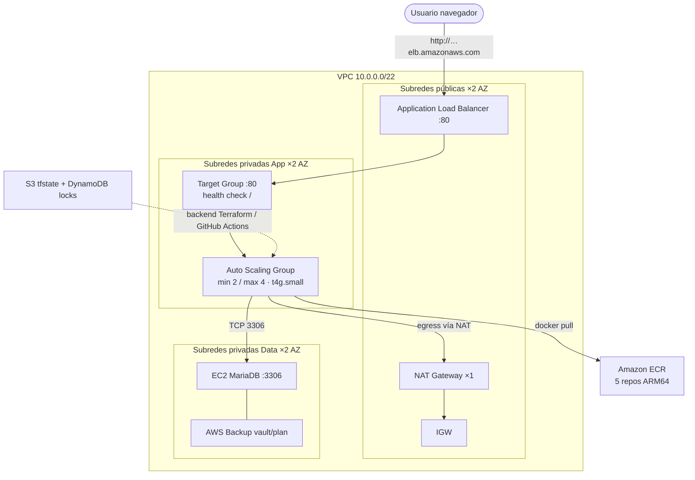
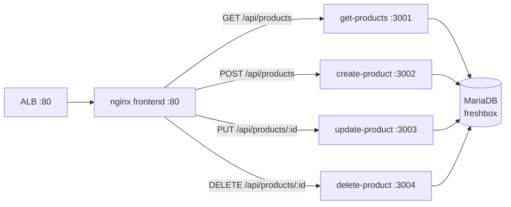
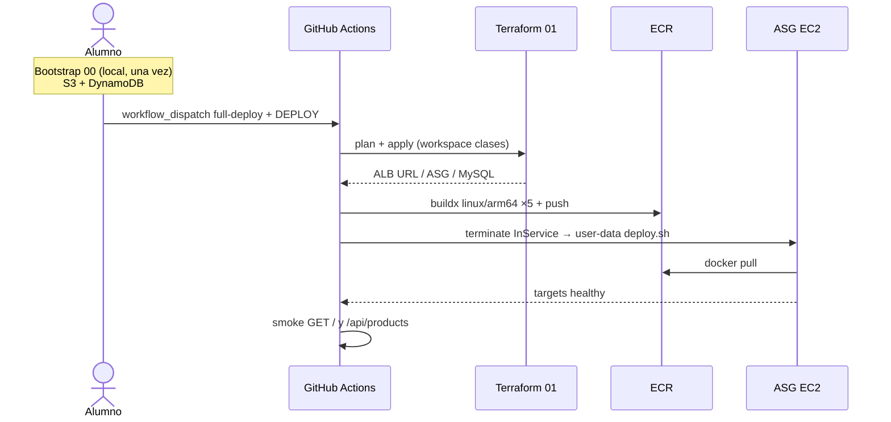

# Arquitectura FreshBox EP1 (ARY1102)

Infraestructura **3 capas Multi-AZ** en `us-east-1`, workspace Terraform `clases`, alineada al Learner Lab (LabRole / LabInstanceProfile, `t4g.small`, key `vockey`).

## Diagrama — topología AWS

## Diagrama — tráfico de aplicación (por EC2 App)

## Diagrama — flujo de despliegue

## Security Groups (estado actual)

| SG | Ingress |
|----|---------|
| ALB | TCP **80** desde `0.0.0.0/0` |
| App | TCP **80** solo desde SG-ALB |
| Data | TCP **3306** solo desde SG-App |

> No hay listener HTTPS en el ALB: abrir siempre `http://`.

## Checklist de evidencia

Ver [README.md](./README.md) en esta misma carpeta (capturas consola + CRUD).
