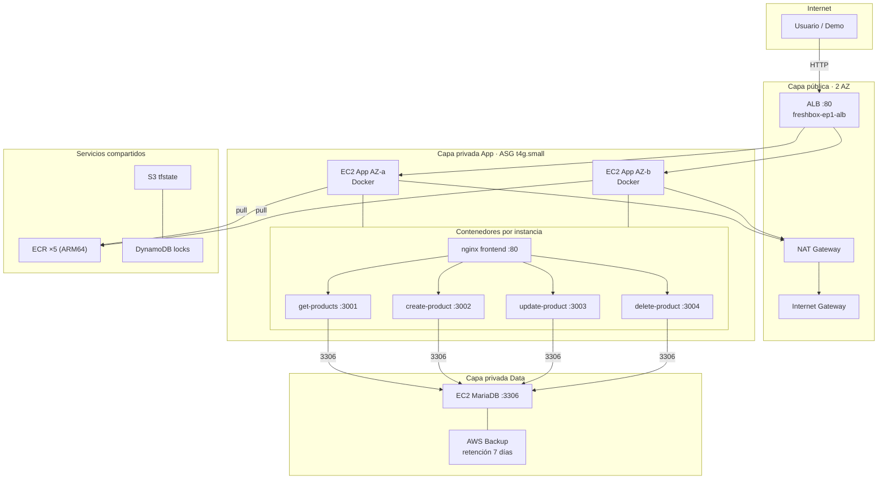

# FreshBox SpA — Plataforma de Catálogo Online (EP1 / ARY1102)

Terraform + Docker + GitHub Actions (semi-auto) para **AWS Academy Learner Lab**, basado en el ZIP `desarrolloappEP1`.

## Diagrama de arquitectura

Vista completa (también en [`04-architecture-evidence/arquitectura-freshbox.md`](04-architecture-evidence/arquitectura-freshbox.md)):



## Estructura del repo

| Carpeta | Rol |
|---------|-----|
| `00-terraform-state/` | Bootstrap S3 + DynamoDB (state remoto) |
| `01-cloud-infrastructure/` | VPC, ALB, ASG, MySQL, ECR, Backup |
| `02-container-images/` | Notas de imágenes |
| `03-deployment-scripts/` | Scripts locales (push, deploy, validate) |
| `04-architecture-evidence/` | Diagramas + checklist de evidencia EP1 |
| `.github/workflows/` | CI + Deploy Lab semi-auto |

## Despliegue recomendado (GitHub)

Detalle: [`.github/README.md`](.github/README.md)

1. **Una vez (local):** bootstrap `00-terraform-state`
2. **GitHub Environment `clases`:** Secrets AWS + Variables del bucket/tabla
3. **Actions → Deploy Lab (semi-auto):**
   - Primero `plan`
   - Luego `full-deploy` + confirmación `DEPLOY`
   - Cambios solo de app: `images-only` + `DEPLOY`

Abre el ALB siempre con **`http://`** (no hay listener HTTPS).

## Arranque local (alternativa)

```bash
export AWS_PROFILE=clases
cd 01-cloud-infrastructure
cp backend.hcl.example backend.hcl   # edita bucket/table
terraform init -reconfigure -backend-config=backend.hcl
terraform workspace select clases || terraform workspace new clases
terraform apply -var-file=environments/clases/terraform.tfvars
cd ..
./03-deployment-scripts/push-images-to-ecr.sh
./03-deployment-scripts/deploy-docker-services.sh
./03-deployment-scripts/validate-ep1.sh
```

## Prueba del ZIP (sin AWS)

```bash
docker compose up -d --build
# http://localhost:8080
```

## Cerrar el lab

Workflow `destroy` + confirmación `DESTROY`, o:

```bash
cd 01-cloud-infrastructure
terraform destroy -var-file=environments/clases/terraform.tfvars
```
